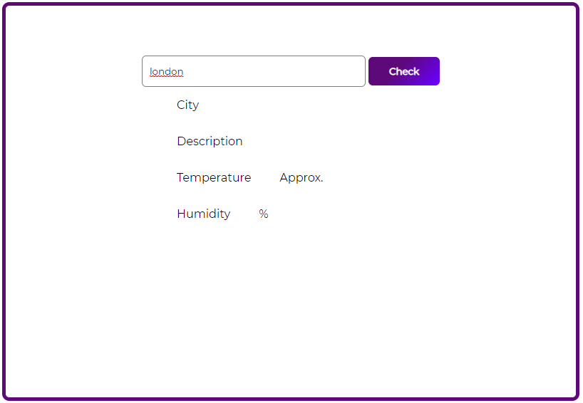
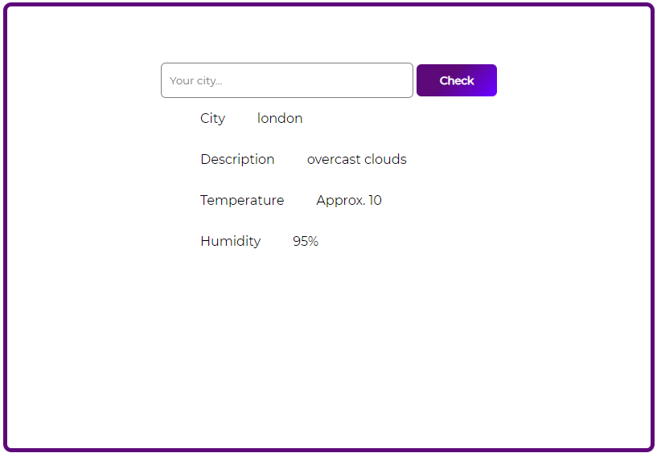

## Weather_App

## About this web app

This web application tells the weather of the specified city. 

1. User just have to enter any city name for example London here


<br>

2. And the output is given in the form of city(city name), description(short title for the weather in the city), temperature(in celcius) and humidity(in percentage).


<br>

## Tech used for this project
<a href="https://palletsprojects.com/p/flask/">  </a>
<a href="https://www.python.org/about/">  </a> 


<a href="https://code.visualstudio.com/docs">  </a>
<br>

## To run this web app
1. To run this web app first you need to install flask library(a framework for Web Development in Pyhton)
```
pip install Flask
```
check the installation and documentation [here](https://pypi.org/project/Flask/)

2. Clone this repository on your local machine.
3. To run this project use : 
```
python app.py
```
